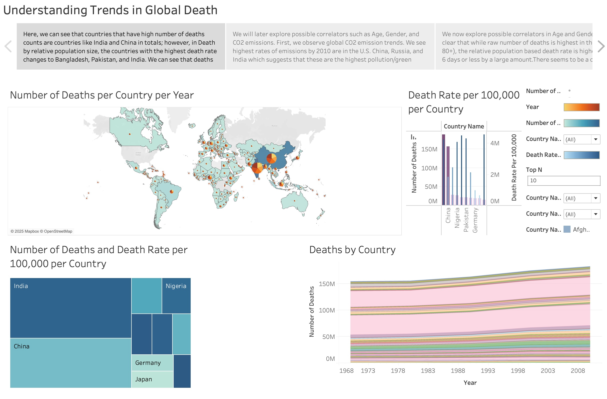
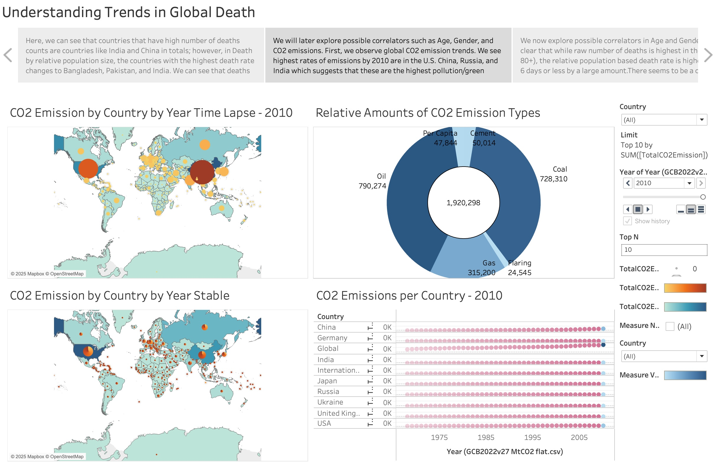
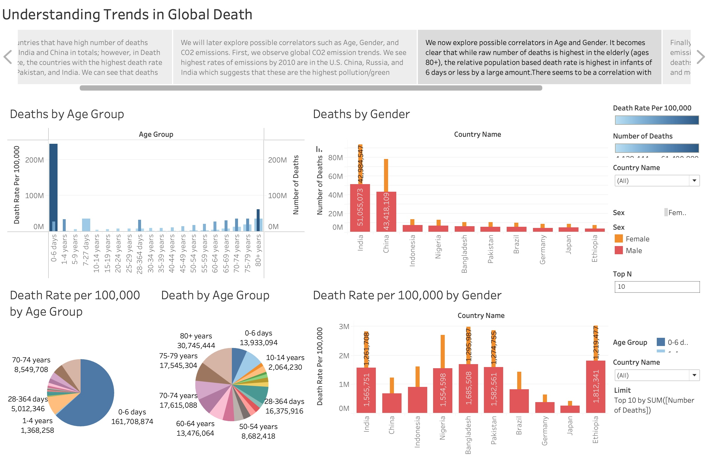
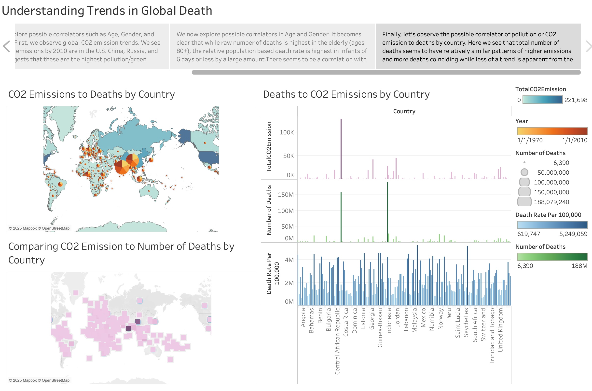

# Understanding Trends in Global Death

## Project Overview
This project explores global death trends by analyzing possible correlations with factors such as age, gender, and CO2 emissions. Using Tableau, we have visualized key insights into mortality rates, pollution levels, and their possible relationships with deaths across different demographics and geographies.

## About Me
Hi! I'm __Yash Gupta__, a graduate student at __Washington University in St. Louis, Olin Business School__, pursuing my __Master of Science in Business Analytics - Customer Analytics__. I have a strong passion for data-driven problem-solving and storytelling, with experience across data engineering, analytics, and marketing research in industries like real estate, environmental sustainability, and digital marketing.
With expertise in Python, SQL, R, Tableau, Azure, Databricks, Power BI, and more, I have worked on projects involving text mining, customer segmentation, market research, and database optimization. My goal is to deepen my knowledge of statistical and machine learning techniques while sharpening my ability to translate complex data insights into actionable business strategies.

I am interested in roles that focus on translating complex business problems into mathematically and statistically solvable frameworks and delivering __actionable insights__ that empower clients and stakeholders to maximize the value of their investment in data-driven decision-making.

## Data and Insights
This study utilizes multiple datasets to explore mortality trends across different countries. The primary areas of focus include:
- **Geographical Death Patterns**: Mapping the total number of deaths per country and per 100,000 people.
- **CO2 Emission Trends**: Examining total CO2 emissions by country and type.
- **Mortality by Age and Gender**: Understanding how death rates vary across age groups and between males and females.
- **CO2 Emissions vs. Deaths**: Investigating potential correlations between pollution levels and mortality.

## Tableau Visualizations
The following Tableau dashboards were created to illustrate these findings:

### Deaths by Country Over Time
<!-- -->

### CO2 Emissions & Global Trends
<!-- -->

### Deaths by Age & Gender
<!-- -->

### Correlation Between CO2 Emissions & Deaths
<!-- -->

## License
This project is open-source and available for further exploration and enhancement.

---
